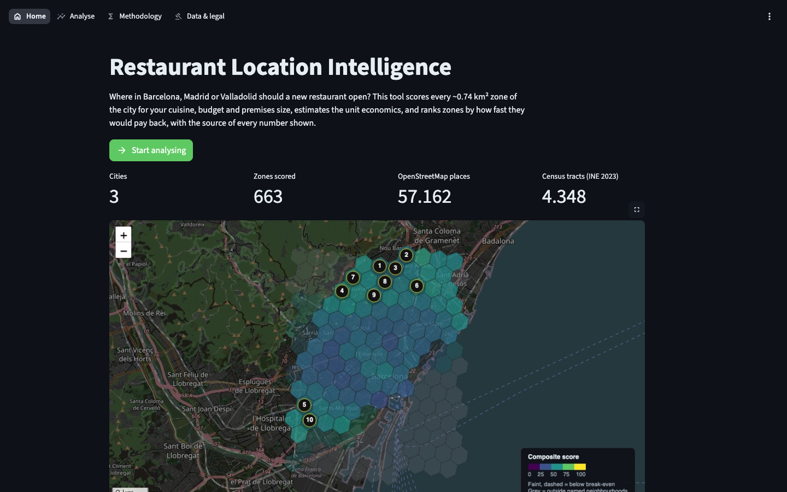
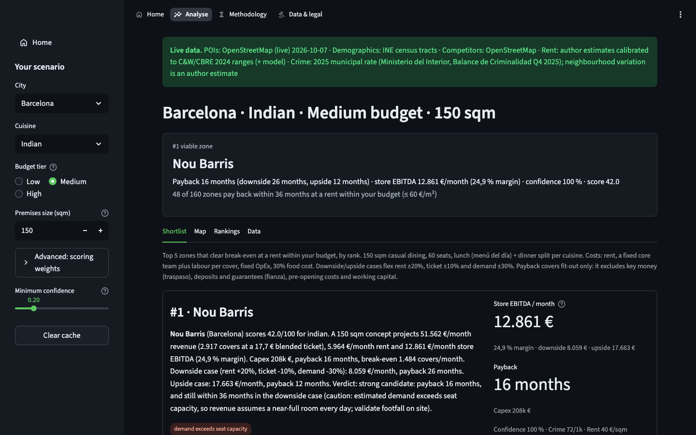
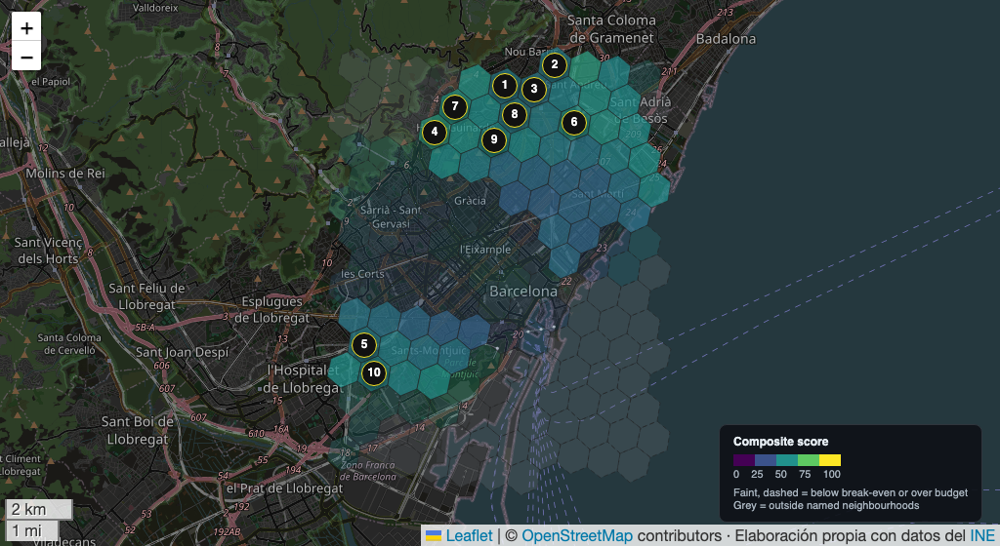

# Restaurant Location Intelligence Tool

> Data-driven site selection for restaurants in Spanish cities.
> Every ~0.74 km² zone gets unit economics (revenue, costs, payback with downside and upside cases)
> and a 0-100 composite score, ranked economics-first, with the source of every input shown.

[](https://github.com/Digvijay-classai/restaurant-location-intel/actions/workflows/ci.yml)


**[Live demo](https://restaurant-location-intel.streamlit.app)** ·
**[Methodology](docs/methodology.md)** ·
**[Architecture](docs/architecture.md)** ·
**[Data dictionary](docs/data_dictionary.md)** ·
**[Changelog](CHANGELOG.md)** ·
**[Data licences](DATA_LICENSES.md)** ·
**[Disclaimer](DISCLAIMER.md)**

> Independent portfolio and research project. Figures are model estimates,
> not financial or investment advice. See [DISCLAIMER.md](DISCLAIMER.md).



## App tour

The live app has four pages, linked from the top navigation. Every page except Home has a **Home** link at the top of the sidebar.

| Page | What you do there |
|------|-------------------|
| **Home** | Read what the tool answers and how to use it. Open one of three example scenarios in one click (one of them shows the tool saying "no"). |
| **Analyse** | Pick city, cuisine, budget and premises size. See the #1 zone with payback and downside/upside cases, the **Shortlist** briefs, the **Map**, the full **Rankings**, and **Data** exports (CSV and GeoJSON). |
| **Methodology** | The full model: components, demand and cost formulas, ranking, verdict rules, limitations. |
| **Data & legal** | Every data source with its licence and attribution, the disclaimer and privacy note. |

Your inputs persist when you move between pages.





## What it does

Pick a city, a cuisine, a budget tier and a premises size. For every H3
hex the tool computes:

- **Unit economics:** demand from residents and visitors, reduced by each
  same-cuisine competitor nearby and capped at seat capacity; then
  revenue, rent, labour, food, store EBITDA, break-even covers, capex and
  payback. Every zone also gets a **downside case** (rent +20%, ticket −10%,
  demand −30%) and an **upside case**.
- **Eight component scores:** competition gap, foot traffic, income match,
  tourism, restaurant ecosystem, spend capacity, rent affordability and
  safety. These are combined into a 0-100 composite using weights you can
  change.
- **One ranking**, economics first: zones that pay back within 36 months at a rent within your budget
  come first, sorted by payback. The same rank numbers appear on the map
  pins, in the table and in the shortlist briefs.

The first thing on screen is **where the data came from**. If any core
input is synthetic or estimated, the app says so and gives numbers but no
go/no-go verdict.

## Data shipped with the repo

| City | POIs | Demographics (INE census tracts, 2023) | Verdicts |
|------|------|----------------------------------------|----------|
| Barcelona | Live OpenStreetMap (Oct 2026), 22,164 POIs | 1,433 tracts, 2.15M residents | Shown |
| Madrid | Live OpenStreetMap (Oct 2026), 31,062 POIs | 2,638 tracts, 3.60M residents | Shown |
| Valladolid | Live OpenStreetMap (Oct 2026), 3,936 POIs | 277 tracts, 333k residents | Shown |

Demographics come from INE's Atlas de Distribución de Renta de los Hogares:
population, net income and foreign share per census tract, fetched with
`python scripts/fetch_ine_tracts.py <city>`. Rent is seeded per
neighbourhood from Cushman & Wakefield / CBRE Spain 2024 reports and
blended with a model.

## Quick start

```bash
git clone https://github.com/Digvijay-classai/restaurant-location-intel.git
cd restaurant-location-intel

python -m venv .venv && source .venv/bin/activate
pip install -r requirements.lock     # exact tested versions

streamlit run app.py
```

Open http://localhost:8501: the app opens on the Home page. The snapshots
are committed, so it loads in about a second with no network and no API
keys.

## Refreshing data

```bash
python scripts/fetch_ine_tracts.py madrid        # INE census-tract demographics (free, ~1 min)
python scripts/pull_live_data.py madrid          # live OSM via Overpass (1-5 min)
python scripts/pull_live_data.py madrid --places # + Google Places competitor counts
python scripts/validate_snapshots.py             # what is committed, and from where
```

If `overpass-api.de` is busy (HTTP 504), point `OVERPASS_URL` at a mirror
in `.env`, e.g. `https://overpass.kumi.systems/api/interpreter`. On any
failure the existing snapshot is left untouched.

Offline, deterministic **synthetic** snapshots (labelled SYNTHETIC in the
app) are available with `python scripts/build_demo_data.py`. That script
never overwrites live data unless you pass `--force`.

### Google Places (optional, private use only)

```bash
cp .env.example .env    # add GOOGLE_PLACES_API_KEY
python scripts/pull_live_data.py barcelona --places        # writes data/private/ (gitignored)
RLI_SNAPSHOT_DIR=data/private streamlit run app.py
```

Places counts are fetched during the refresh (about 9 calls per hex;
counts cap at 20) and cached in SQLite. Google's terms don't allow Places
content on a non-Google map or cached long-term. So Places snapshots stay
private, CI rejects them if committed, and the app hides its map and
credits Google when one is loaded. The public demo uses OpenStreetMap
competitor counts.

### Commercial rents

`data/rent/<city>.csv` holds rent per neighbourhood. The shipped figures
are author estimates calibrated to public C&W / CBRE ranges. To use listings you are licensed to
use (a broker export, a purchased data feed, your own survey):

```bash
python scripts/import_rent_listings.py barcelona my_listings.csv --source broker_export_2026-10
```

The project contains no scrapers: listing portals forbid scraping, and
Spanish law protects their databases.

## Key design decisions

1. **Economics decide the rank; the composite colours the map.** They are
   independent, so the score can't inflate the revenue.
2. **Provenance is part of the data.** Each snapshot records where each
   input came from and when, and verdicts are gated on it.
3. **H3 hex grid** for consistent ~0.74 km² units, smoothed over each
   hex's 6 neighbours with edge correction.
4. **Open data first.** OSM and INE are free; Google Places is optional.
5. **One registry per concept.** Adding a city is one entry in
   `src/cities.py`; adding a cuisine is one entry in `src/cuisines.py`.

## Limitations

- Foot traffic is proxied from static POIs, not measured.
- **The demand model is not calibrated against real outcomes.** It counts
  only same-cuisine competitors, so in dense Barcelona and Madrid areas
  demand often hits seat capacity. The ranking then leans on rent, and
  paybacks of ~1 year look optimistic. Treat verdicts as a shortlist to
  validate on foot, not a signing decision (see TODOS.md: backtest).
- Demographics are INE 2023 census tracts aggregated over a 1 km disc.
  Tourists and commuters are only captured through the hotel and
  attraction proxies.
- Rent is seeded per neighbourhood and blended with a model, so it misses
  corner and metro-exit premiums.
- Neighbourhoods are centroid circles. Hexes outside them are "Outskirts"
  and ranked last.
- Licence/BIC flags are district-level. Verify the sub-barrio before
  signing.
- Not yet backtested against real openings and closures (see
  [TODOS.md](TODOS.md)).
- Standalone dine-in only.

## Development

```bash
pip install -r requirements.lock && pip install -e .
make test        # 90+ tests incl. Streamlit AppTest UI flows
make validate    # snapshot schema check (also run in CI)
```

See [CONTRIBUTING.md](CONTRIBUTING.md) for adding cities and cuisines, and
for the golden-ranking test that makes model changes reviewable.

## Deploy your own

1. Fork this repo.
2. On [share.streamlit.io](https://share.streamlit.io), create an app: repository = your fork, branch `main`, main file `app.py`, Python 3.11.
3. No secrets are needed: the snapshots are committed. Do not add a Google Places key to a public deployment (see "Google Places" above).

## Repository layout

```
app.py                       Streamlit entry point: page config + navigation
views/                       pages: home, analyze, methodology, data_legal
src/
  cities.py, cuisines.py     registries
  pipeline.py                snapshots, builder, scoring orchestration, provenance
  scoring/                   engine (components), financial_model (economics, rank), weights
  data_sources/              OSM/Overpass, INE (API + tracts), rent listings, Google Places, crime, tourism, neighbourhoods
  geo/                       boundaries, H3 grid, distance
  viz/                       Folium map, colour tokens, shared UI (CSS, footer, docs rendering)
  export.py, formatting.py   GeoJSON export, es-ES formatting
scripts/                     fetch_ine_tracts, pull_live_data, import_rent_listings, build_demo_data, validate_snapshots
data/
  sample_output/             committed snapshots (with provenance meta)
  rent/, ine/, cities/       optional per-city inputs
  cache/                     Overpass + Places caches (gitignored)
tests/                       pytest (+ golden ranking, fixtures)
docs/                        methodology, architecture, data dictionary, screenshots
```

## Licence, attribution and disclaimer

- **Code:** MIT ([LICENSE](LICENSE)).
- **Data:** each source keeps its own licence; see [DATA_LICENSES.md](DATA_LICENSES.md).
  The snapshots (`data/sample_output/`) are released under the ODbL.
  - © [OpenStreetMap](https://www.openstreetmap.org/copyright) contributors (ODbL)
  - Elaboración propia con datos extraídos del sitio web del [INE](https://www.ine.es) (CC BY 4.0)
  - Crime: Ministerio del Interior, Balance de Criminalidad 2025 (municipal rate; neighbourhood variation is an author estimate)
  - Rent: author estimates calibrated to Cushman & Wakefield / CBRE Spain 2024 public ranges (not their published figures)
  - Map tiles © [OpenStreetMap](https://www.openstreetmap.org/copyright) contributors ([tile usage policy](https://operations.osmfoundation.org/policies/tiles/): light use)
- **Disclaimer:** an independent portfolio project, not affiliated with any data
  provider. Figures are estimates, not advice, and come with no warranty. See
  [DISCLAIMER.md](DISCLAIMER.md).
